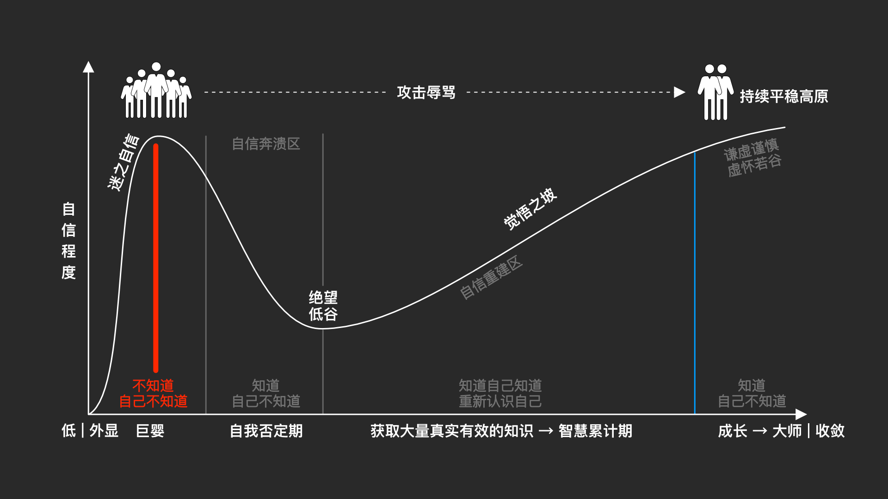

# Tech-Architecture

技术架构研究和学习，Technology Architecture study and learn

## 邓宁-克鲁格效应

[邓宁-克鲁格效应](https://zh.wikipedia.org/wiki/鄧寧-克魯格效應)

## 技术架构研究 TODO List

- [ ] 设计模式研究
- [ ] 小程序架构研究
- [ ] 安卓系统架构研究
- [ ] 安卓应用MVVM架构研究
- [ ] 安卓应用MVP架构研究
- [ ] 安卓应用模块化架构研究
- [ ] 安卓应用混合架构研究
- [ ] iOS系统架构研究
- [ ] iOS应用MVVM架构研究
- [ ] iOS应用MVP架构研究
- [ ] iOS应用VIPER架构研究
- [ ] iOS应用模块化架构研究
- [ ] iOS应用混合架构研究
- [ ] React架构研究
- [ ] ReactNative架构研究
- [ ] Vue架构研究
- [ ] Angular架构研究
- [ ] Webpack架构研究
- [x] [Flutter架构研究](flutter-architecture/README.md)
- [ ] RxJava架构研究
- [ ] RxSwift架构研究
- [ ] RxJS架构研究
