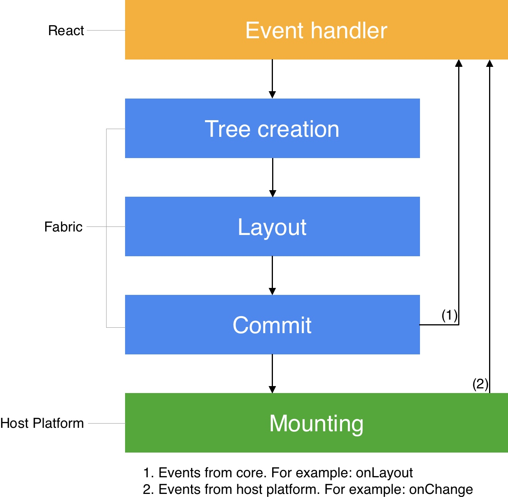
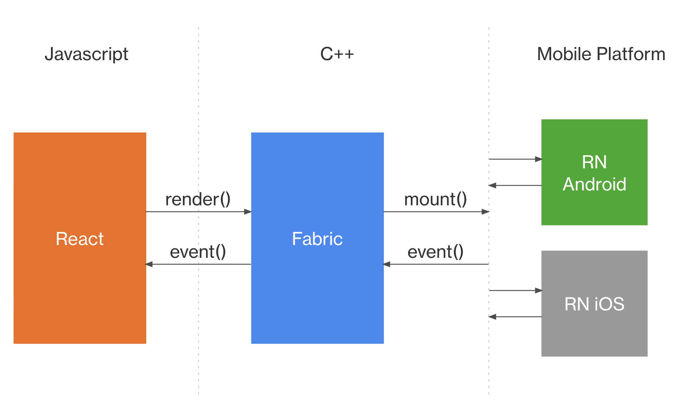

# React-Native 技术架构(React-Native Architecture)

React-Native技术架构研究和学习，React-Native architecture study and learn。

## React-Native 技术架构 Overview

## React-Native 数据流

## React-Native 渲染管道(Render Pipeline)

## React-Native 跨平台实现图

## 🔭 学习更多

* [React-Native Architecture Overview](https://reactnative.dev/architecture/overview)
* [React-Native Fabric 渲染器](https://reactnative.dev/architecture/fabric-renderer)
* [React-Native Render, Commit 和 Mount 三个阶段](https://reactnative.dev/architecture/render-pipeline)
* [React-Native 跨平台实现](https://reactnative.dev/architecture/xplat-implementation)
* [React-Native View Flattening 视图扁平化](https://reactnative.dev/architecture/view-flattening)
* [React-Native Threading Model 线程模型](https://reactnative.dev/architecture/threading-model)
* [React-Native Glossary 术语表](https://reactnative.dev/architecture/glossary)
